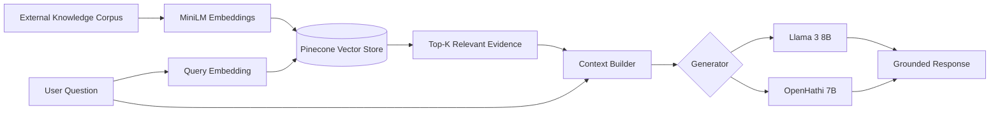
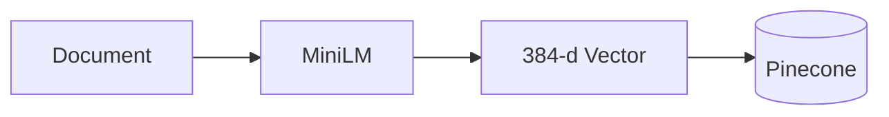
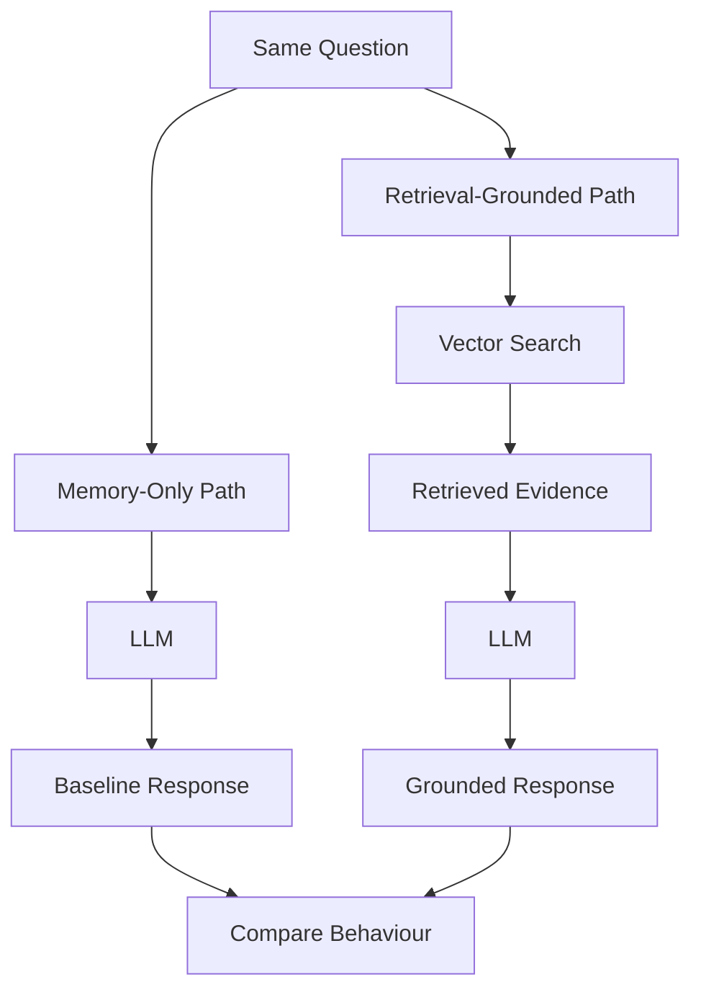
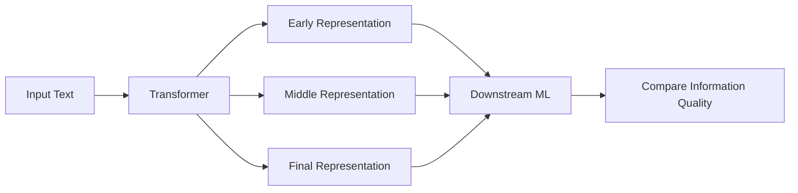

# RAG Hallucination Evaluation

### Building an external evidence layer for language models

LLMs are remarkably good at producing answers.

The harder question is:

> **What evidence was that answer based on?**

A model can generate fluent, confident text even when the underlying fact is incomplete, weakly represented, or simply wrong.

This project explores a different architecture:

**Do not ask the model to remember everything. Give it a way to retrieve evidence first.**

`Llama 3` · `OpenHathi` · `MiniLM` · `Pinecone` · `LangChain` · `Python`

---

## The Idea

Traditional generation relies almost entirely on what the model learned during training.

```text id="j92is8"
            PARAMETRIC MEMORY

Question ───────► LLM ───────► Answer
                   │
                   ▼
             "Trust me."
```

This project adds an external knowledge path.

```text id="mww0kp"
                EXTERNAL MEMORY

                     ┌───────────────┐
                     │ Knowledge Base│
                     └───────┬───────┘
                             │
                             ▼
Question ──► Retrieve Evidence ──► LLM ──► Answer
                                      ▲
                                      │
                               Grounded Context
```

Instead of:

**ask → generate**

the system becomes:

**ask → retrieve → ground → generate**

---

# System Architecture



### Core path

```text id="j1uzac"
Question
   │
   ▼
Semantic Embedding
   │
   ▼
Vector Search
   │
   ▼
Relevant Evidence
   │
   ▼
Context Augmentation
   │
   ▼
Language Model
   │
   ▼
Grounded Response
```

---

# 1. Build External Memory

The system begins with an external document corpus.

Each document is transformed using:

```text id="mx3w3g"
sentence-transformers/all-MiniLM-L6-v2
```

into a **384-dimensional semantic embedding**.



Pinecone stores these representations using **cosine similarity**, allowing semantically related information to be discovered even when the query does not use exactly the same words.

---

# 2. Search by Meaning

The user question passes through the same embedding model.

```text id="wzh5vx"
User Question
      │
      ▼
   MiniLM
      │
      ▼
 Query Vector
      │
      ▼
┌──────────────┐
│   Pinecone   │
└──────┬───────┘
       │
       ▼
Most Relevant Evidence
```

The retrieval layer can be inspected independently:

```python id="gn4knk"
response = vectorstore.similarity_search(query, k=5)
```

That gives the architecture something standalone LLM generation does not naturally provide:

**an observable evidence trail before generation begins.**

---

# 3. Ground the Model

The retrieved documents are combined with the original question and passed to the generator.

```text id="8ymnig"
┌───────────────────────────┐
│ Retrieved Evidence        │
│                           │
│ Context #1                │
│ Context #2                │
│ Context #3                │
└────────────┬──────────────┘
             │
Question ────┤
             ▼
      ┌──────────────┐
      │     LLM      │
      └──────┬───────┘
             │
             ▼
      Evidence-Aware
          Response
```

The orchestration uses LangChain's `RetrievalQA`:

```python id="h463az"
rag_pipeline = RetrievalQA.from_chain_type(
    llm=llm,
    chain_type="stuff",
    retriever=vectorstore.as_retriever()
)
```

---

# The Experiment

The system deliberately creates two competing paths.



### Path A — model memory

```text id="v2icns"
Question
   ↓
LLM
   ↓
Answer
```

### Path B — external evidence

```text id="b8644g"
Question
   ↓
Semantic Retrieval
   ↓
Evidence
   ↓
LLM
   ↓
Answer
```

The comparison focuses on situations where language models are vulnerable to:

* incorrect factual recall;
* unsupported additions;
* irrelevant continuation;
* answers produced with confidence despite weak knowledge.

---

# Two Different Generators

The same retrieval architecture is tested with two language-model families.

```text id="sjvq3g"
                      ┌──► Llama 3 8B Instruct
Retrieved Evidence ───┤
                      └──► OpenHathi 7B
```

This separation matters.

A RAG system has two different intelligence layers:

```text id="k66zww"
              RAG SYSTEM

         ┌─────────────────┐
         │    Retriever    │
         │ "What matters?" │
         └────────┬────────┘
                  │
                  ▼
         ┌─────────────────┐
         │    Generator    │
         │ "What does it   │
         │     mean?"      │
         └─────────────────┘
```

A failure in one does not imply a failure in the other.

---

# Debugging RAG

This changes how incorrect answers can be investigated.

```text id="s9g2qe"
                Bad Answer
                    │
        ┌───────────┴────────────┐
        ▼                        ▼
 Was retrieval wrong?      Was generation wrong?
        │                        │
 wrong/missing              good evidence,
   evidence                 poor reasoning
```

That distinction is one of the most useful properties of retrieval-grounded systems.

---

# What the System Demonstrates

### 1. Knowledge does not have to live inside the model

```text id="nra1lc"
Traditional

Knowledge ──► Model Weights ──► Answer


RAG

Knowledge ──► External Store
                    │
                    ▼
                 Retrieve
                    │
                    ▼
                   LLM
                    │
                    ▼
                  Answer
```

External knowledge can evolve independently of the generator.

---

### 2. Retrieval makes evidence observable

Before the model generates anything, the system can inspect:

```text id="cwau8o"
Query
 ├── Retrieved Document #1
 ├── Retrieved Document #2
 ├── Retrieved Document #3
 ├── Retrieved Document #4
 └── Retrieved Document #5
```

This gives the pipeline a clear information boundary.

---

### 3. Retrieval quality becomes a first-class problem

```text id="j8fpoq"
         Final RAG Quality
                │
       ┌────────┴────────┐
       ▼                 ▼
 Retrieval Quality   Generation Quality
```

A powerful LLM cannot reliably recover from consistently irrelevant evidence.

---

### 4. RAG improves grounding — not certainty

Retrieval does not magically eliminate hallucination.

A production-grade evolution of the system looks more like:

```text id="tvswn1"
Query
  ↓
Retrieval
  ↓
Filtering
  ↓
Reranking
  ↓
Grounding
  ↓
Generation
  ↓
Validation
  ↓
Citations
```

This project explores the foundation of that architecture.

---

# Looking Inside the LLM

The project also asks another question:

> **Where does useful information emerge inside a transformer?**

Different hidden layers are extracted and evaluated on downstream tasks.



Two experiments probe these internal representations.

### Semantic classification

```text id="2xa56t"
Text
 ↓
Transformer Representation
 ↓
Random Forest
 ↓
Semantic Category
```

### Regression

```text id="xxlcyq"
Movie Description
 ↓
Transformer Representation
 ↓
Linear Regression
 ↓
Predicted Rating
```

Together, the two sides of the project examine:

```text id="d9xipx"
              LANGUAGE MODEL SYSTEMS

        External Knowledge      Internal Knowledge
                │                      │
                ▼                      ▼
              RAG                 Layer Probing
                │                      │
                └──────────┬───────────┘
                           ▼
                 Understanding how
                 LLMs know and reason
```

---

# Technology

| Layer               | Technology                |
| ------------------- | ------------------------- |
| Generators          | Llama 3 8B, OpenHathi 7B  |
| Embeddings          | MiniLM `all-MiniLM-L6-v2` |
| Vector Search       | Pinecone                  |
| Similarity          | Cosine similarity         |
| RAG orchestration   | LangChain `RetrievalQA`   |
| Retrieval corpus    | AG News                   |
| ML                  | PyTorch, scikit-learn     |
| Additional datasets | IMDB, DBpedia 14          |
| Runtime             | Python / GPU              |

---

# Repository Map

```text id="9t2opm"
RAG Hallucination Evaluation
│
├── Model Loading
│   ├── Llama 3
│   └── OpenHathi
│
├── Hallucination Analysis
│   └── Baseline generation
│
├── Retrieval Layer
│   ├── MiniLM embeddings
│   ├── Pinecone indexing
│   └── cosine similarity search
│
├── RAG Layer
│   ├── context retrieval
│   ├── Llama + RAG
│   └── OpenHathi + RAG
│
└── Representation Analysis
    ├── transformer layer extraction
    ├── IMDB regression
    └── DBpedia classification
```

---

# Why I Built It

The starting point was a simple reliability problem:

```text id="e8fr6j"
LLM says something confidently
              │
              ▼
      Is it actually grounded?
```

Instead of treating hallucination only as a model-training problem, I wanted to explore it as a **systems problem**.

What happens if the architecture gives the model:

* external memory;
* semantic search;
* explicit evidence;
* an observable retrieval step;
* and a constrained context before generation?

That question led naturally to RAG.

And the same idea extends beyond question answering.

```text id="aul8ol"
Knowledge Base
     │
     ▼
 Retrieval
     │
     ▼
 Reasoning
     │
     ▼
 Tool / Agent / Application
```

Retrieval becomes one of the foundational primitives for larger AI systems: assistants, domain agents, research systems, support copilots, and multi-stage agentic workflows.

---

# Core Principle

```text id="oubrj8"
            Model-Only AI

Question ─────────► Model ─────────► Answer


         Retrieval-Grounded AI

Question
   │
   ▼
Find Relevant Knowledge
   │
   ▼
Build Evidence Context
   │
   ▼
Reason With the Model
   │
   ▼
Generate the Answer
```

### **Do not ask the model to remember everything. Give it the ability to find what it needs.**
